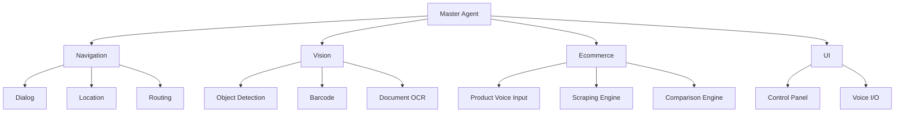

# VisionAID: Intelligent Assistant for the Visually Impaired 👁️‍🗨️♿


VisionAID is an intelligent assistive system that combines voice-controlled navigation with real-time environmental awareness for visually impaired people and others. The system processes spoken commands to guide users to destinations using offline routing (OSRM/Geopy), while its computer vision modules detect objects (YOLOv8), scan barcodes (ZXing), and read documents (Tesseract/EasyOCR). Designed for full offline operation, it runs efficiently on low-cost hardware like Raspberry Pi, delivering accurate results through a modular Python architecture that integrates Whisper for speech recognition and pygame for audio feedback.

## Features ✨

### Navigation Module 🗺️
- Voice-controlled destination selection ("Find a hospital")
- Automatic GPS location detection
- Turn-by-turn audio guidance

### Vision Modules 👁️
| Feature | Description | Tech Used |
|---------|-------------|-----------|
| Object Detection | Identifies 80+ common objects in real-time | YOLOv5 |
| Barcode Reader | Scans EAN/UPC codes and announces products | OpenCV+ZXing |
| Product Analyzer | Reads ingredients/nutrition facts | OCR+Tesseract |
| Document Reader | Reads printed text with formatting | EasyOCR |

### Ecommerce Agent 🛒 
- Voice-based product query (e.g. “Find a backpack”)
- Searches top results from Amazon and eBay
- Compares prices and announces best deal
- Works entirely via voice I/O for hands-free use

## Installation 💻

```bash
# Clone with submodules
git clone --recurse-submodules https://github.com/Viraj97-SL/Project1.git
cd Project1

# Install with pip
pip install -r requirements.txt

# Additional setup for audio
sudo apt-get install portaudio19-dev  # Linux
brew install portaudio               # MacOS

``` 

## Project Structure 🗂️

```markdown
## Project Structure

visionAID/
├── .venv/                        # Virtual environment
├── agents/
│ ├── navigation/                 # Navigation subsystem
│ │ ├── dialog_agent.py           # Voice interface (Whisper STT/TTS)
│ │ ├── location_agent.py         # Geospatial search (OSM/Nominatim)
│ │ ├── navigation_agent.py       # sub_main agent for navigation
│ │ ├── navigator.py              # Guidance engine
│ │ └── route_planner.py          # OSRM pathfinding
│ ├── ecommerce_agent/            # NEW: Ecommerce subsystem
│   ├── ecommerce_agent.py        # Coordinator
│   ├── product_capture_agent.py  # Voice capture + Whisper
│   ├── web_scraper_agent.py      # Amazon/eBay scraper
│   └── summary_agent.py          # Price comparison
│ ├── barcode_reader.py           # ZXing-based scanner
│ ├── document_ocr.py             # Tesseract/EasyOCR processor
│ └── object_detection.py         # YOLOv8 real-time detection
├── core/
│ ├── config.yaml                 # App configuration
│ ├── master_agent.py             # Main controller
│ ├── utils.py                    # Common utilities
│ └── voice_control.py            # Audio pipeline
├── memory/                       # Runtime artifacts
│ ├── session_history.log         # JSON activity log
│ └── output.wav                  # Audio cache
├── control_ui.py                 # PyQt interface
├── requirements.txt              # Pip dependencies
└── yolov8n.pt                    # Pretrained vision model

```


### Component Relationships



## Key Technologies 🛠️


### Navigation Agent
Voice Processing

* Whisper (OpenAI's speech-to-text)

* PyAudio/sounddevice (audio capture)

Routing & Geocoding

* OSRM (Open Source Routing Machine)

* Geopy + Nominatim (location search)

### Vision Modules
Object Detection

* YOLOv8 (via yolov8n.pt weights)

* OpenCV (image processing)

Barcode/OCR

* ZXing and Pyzbar (barcode scanning)

* Tesseract/EasyOCR (text extraction)

### Ecommerce Agent
Voice Product Capture

* Whisper + sounddevice (voice interface)

Web Scraping

* BeautifulSoup + Requests (Amazon, eBay)

Comparison Logic

* Filtering, sorting, and summarizing deals via custom agent

### Core System

* Utilities

* PyYAML (for config.yaml)

* NumPy (audio/data processing)

### Audio Feedback

* pygame/gTTS (text-to-speech)

## Documentation 📚

User Guide

API Reference

Development Setup
